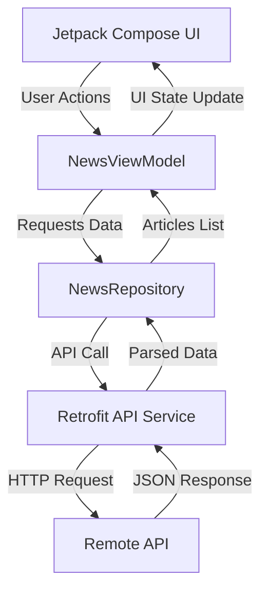
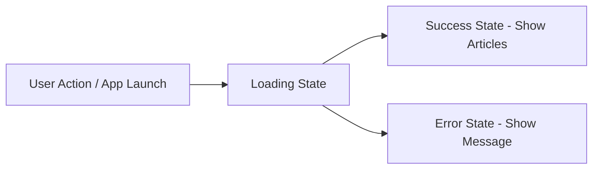

# 📰 Newspaper App – Android News Application


> A modern Android News App built with Jetpack Compose, MVVM & Retrofit.  
> Real-time news by category with clean UI, pull-to-refresh, and robust error handling.

---

## ✨ Highlights

- 📰 Real-time news updates  
- ⚡ Smooth Jetpack Compose UI  
- 🔄 Pull-to-refresh support  
- 🌙 Light / Dark mode toggle  
- 📱 Tablet compatibility  
- 🚨 Error handling for API & network  

---

This app delivers the latest news across multiple categories with a smooth, responsive UI and supports both **light & dark mode** along with **tablet compatibility**.

---

## ✨ Features

- 🗂️ Browse news by categories (Business, Sports, Technology, etc.)
- 🫟 Splash Screen with App Icon
- 🔄 Pull-to-refresh for latest updates
- ⚡ Fast & responsive UI using Jetpack Compose
- 🧠 MVVM architecture for clean and scalable code
- 🌐 API integration using Retrofit
- 🚨 Robust error handling (network issues, API limits, invalid responses)
- 🔗 Open full articles in browser
- 🌙 Light / Dark mode toggle
- 📱 Tablet mode compatibility
- 🎯 Minimal, modern UI design

---

## 📱 Tech Stack

| Layer        | Technology |
|-------------|-----------|
| UI          | Jetpack Compose |
| Architecture| MVVM |
| Networking  | Retrofit |
| Async       | Kotlin Coroutines |
| State Mgmt  | State / MutableState |
| Language    | Kotlin |

---

## 🏗️ Project Structure
```bash
📦 newspaperapp
┣ 📂 data
┃ ┗ 📜 NewsRepository.kt
┣ 📂 ui
┃ ┣ 📜 NewsScreen.kt
┃ ┣ 📜 NewsItem.kt
┃ ┗ 📜 NewsDetail.kt
┣ 📂 viewmodel
┃ ┗ 📜 NewsViewModel.kt
┣ 📂 network
┃ ┗ 📜 RetrofitInstance.kt
┗ 📜 MainActivity.kt
```
---

## 🧭 Architecture Overview

This app follows the **MVVM (Model-View-ViewModel)** architecture with a unidirectional data flow.


---

## 🔄 Data Flow Explanation

- **UI Layer (Compose)**  
  Displays news and sends user interactions (refresh, category change)

- **ViewModel (NewsViewModel)**  
  Handles UI state (loading, success, error) and communicates with repository

- **Repository (NewsRepository)**  
  Fetches data from API and handles errors

- **Network Layer (Retrofit)**  
  Executes HTTP requests and parses responses

---
## ⚡ State Handling Flow



---

## 🎬 Demo Videos

📹 App flow in mobile and tablet:

https://youtu.be/TcfplDax_m8?si=K_Gs6e-bRGGRmsd5

Demo Videos:

https://github.com/user-attachments/assets/4fe4ea23-45f2-4460-958e-86b1ceb4b46d

https://github.com/user-attachments/assets/c17e31af-5171-40ff-a981-9ad1d0eb8229

https://github.com/user-attachments/assets/a7157688-83bb-4659-b461-7a6faa8cb183

https://github.com/user-attachments/assets/d191b275-8b92-433a-ba64-55b979f4f826

https://github.com/user-attachments/assets/dad6877c-fe01-4777-9d36-678745f0abe4

https://github.com/user-attachments/assets/60e20557-3bfa-4fda-995a-56a39771dd00

https://github.com/user-attachments/assets/8b47432b-2c12-4357-a267-9af8d591ef12

https://github.com/user-attachments/assets/17cf0358-6086-455e-a813-6c7497b4e1cf

https://github.com/user-attachments/assets/2e072a4a-ac49-469f-ab26-9f3a0e556bdb

https://github.com/user-attachments/assets/92d52edf-031d-4cfc-a957-a5cab5bd5abe

https://github.com/user-attachments/assets/fdfcfcf1-a398-456c-b212-a3fe5516d12a  

---

## 🔑 API Key Setup (IMPORTANT)

⚠️ This project **does NOT include an API key** for security reasons.

To run the app with full functionality:

1. Get your API key from a news provider (e.g., GNews / NewsAPI)  
2. Open `local.properties`  
3. Add:
```properties
NEWS_API_KEY=your_api_key_here
```
4. Ensure `BuildConfig` is configured to access this key  

---

## ⚠️ Notes

- API rate limits may apply  
- Internet connection required  
- Some categories may return empty results depending on region  
- API key is required for full functionality  

---

## 🧠 Learnings / Highlights

- Implemented clean MVVM architecture  
- Managed UI state effectively with Compose  
- Handled real-world API failures gracefully  
- Built responsive UI supporting multiple screen sizes  
- Integrated dark/light theme handling  

---

## 🔮 Future Improvements

- 🔍 Search functionality  
- ❤️ Bookmark articles  
- 🗄️ Room Database integration:
  - Offline caching of news  
  - User authentication (Signup/Login)  
- 🔔 Push notifications  
- 📊 Better personalization & recommendations

---

## 📄 License

Copyright (c) 2026 Kunal

**All rights reserved.**

Unauthorized use, reproduction, or distribution of this software, in whole or in part, is strictly prohibited without prior written permission from the author.
